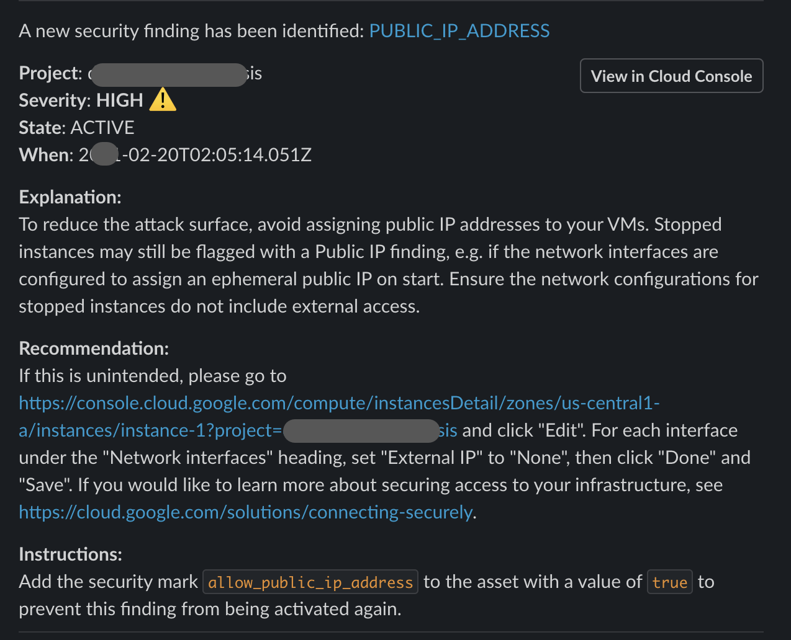

<h1 align="center">

<br>Slack Messages for SCC Findings
</h1>
<h5 align="center"></h5>
<p align="center">
  <a href="#features">Features</a> •
  <a href="#requirements">Requirements</a> • 
  <a href="#installation">Installation</a> •
  <a href="#cleanup">Cleanup</a>
</p>


## Features

Google Security Command Center (SCC) surfaces security issues in the form of Findings. This Slack Message handler extends visibility of those Findings by presenting them into a Slack Channel. 
<p align="center">
	
</p>
The projects is a Google Cloud Function that is triggered by SCC Findings sent to a PubSub Topic. The PubSub configuration may be setup using the related project https://github.com/gschaeffer/scc-alerts. The default filter is for high severity Findings.  

## Requirements

SCC Notifications must be setup. That process is simplified using the related project https://github.com/gschaeffer/scc-alerts. 

## Installation

Set the project value for the gcloud commands.

```bash
PROJECT="[REPLACE_WITH_PROJECT_ID]"

gcloud config set core/project $PROJECT
# Verify the change
gcloud config get-value core/project
```

Create secrets in Cloud Secret Manager. Enable the service if it is not already enabled.

```bash
# Create secret 'slack-token'; replace value including brackets.
print "[SECRET_VALUE]" | gcloud secrets create slack-handler-token --data-file=- --replication-policy user-managed --locations us-central1

# Create secret 'slack-channel'; replace value including brackets.
print "[SECRET_VALUE]" | gcloud secrets create slack-handler-channel --data-file=- --replication-policy user-managed --locations us-central1
```

Deploy the cloud function

```bash
# Clone the repo
git clone https://github.com/gschaeffer/scc-slack-handler

# Update the project id
sed -i '' "s/[PROJECT_ID]/${PROJECT}/g" deploy_func.sh

# Deploy the Cloud Function
./deploy_func.sh
```

## Cleanup

To remove resources use the gcloud scripts below.

```bash
# Remove the Cloud Function 
gcloud functions delete 

# Remove the secrets
gcloud secrets delete slack-handler-token
gcloud secrets delete slack-handler-channel
```


## References
- https://github.com/gschaeffer/scc-alerts
- https://api.slack.com/tools